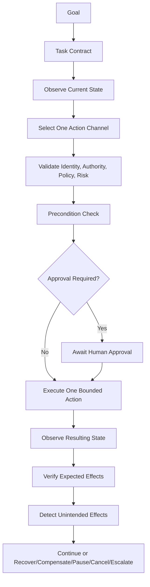

# Agent Execution Partnership AEE
[](LICENSE) [](https://github.com/eli-labz/Agent-Execution-Partnership/releases) [](pyproject.toml) [](CONTRIBUTING.md) [](https://github.com/eli-labz/Agent-Execution-Partnership/stargazers)


https://youtu.be/itK_PBwKzTA

The missing layer between AI reasoning and real-world execution.

Agent Execution Partnership AEE is an open-source control plane that ensures every AI agent action is authorized before it runs, observable while it runs, and verifiable after it completes.

## Purpose

AI reasoning models are good at deciding *what* to do. They are not designed to enforce *whether* it should be done, *who* authorized it, or *whether it actually worked*.

The Action Execution Engine (AEE) fills that gap. It accepts a proposal from an agent, subjects it to policy evaluation, capability checks, and risk classification, executes a single bounded action through the appropriate adapter, and then verifies the outcome against the expected effects — escalating or compensating if anything goes wrong.

The reasoning model owns the intent. The AEE owns the execution contract.

## Safety Principles

- Default deny for all actions.
- Strict capability grants and resource boundaries.
- Mandatory verification after each material action.
- Human approval gates for consequential operations.
- Immutable append-only audit trail.
- Production-impact adapters disabled by default.

## Closed Loop



## Quick Start

1. Create virtual environment and install:

```powershell
py -m venv .venv
.\.venv\Scripts\Activate.ps1
py -m pip install -e .[dev]
```

2. Initialize database and export schemas:

```powershell
aep init
```

3. Run API:

```powershell
aep serve
```

4. Run tests:

```powershell
pytest
```

## Autoresearch Training Workflow

Autoresearch demonstrates the entire closed-loop pipeline in action. Each autonomous training experiment validates all 5 stages:

```
1️⃣  TASK CONTRACT: Goal = "improve validation BPB by ≥0.001"
                  Constraints: 5-min budget, 20M eval tokens, depth ≤ 12
                  Risk budget: 1 failed experiment per 10 iterations
                  Allowed tools: SGD, LoRA, learning rate sweep

2️⃣  OBSERVE STATE: Snapshot current best BPB from `results.tsv`
                  Freshness deadline: start of each 5-min window
                  Measurement: evaluate on pinned shard_06542.parquet

3️⃣  PROPOSE ACTION: "Train model with depth={D}, lr={L}"
                  Channel: training (GPU, 20+ GB VRAM required)
                  Risk class: CONSEQUENTIAL_WRITE (can evolve model)

4️⃣  POLICY EVALUATE: Validate depth ≤ 12, memory ≤ 40GB, time ≤ 300s
                    Allow: if all constraints satisfied
                    Deny: if resource limits exceeded
                    Require approval: if risk budget exhausted

5️⃣  APPROVAL GATE: Human review for unusual patterns or budget depletion
                  Auto-approve: normal variations within envelope
                  Escalate: if multiple failures detected
```

The training loop **runs inside the control plane**, executing this cycle 20+ times per session. Results are immutably logged in the audit trail.

See [examples/README.md](examples/README.md) for a full walkthrough and [examples/local-demo-site/README.md](examples/local-demo-site/README.md) for the interactive demo.

### Quick Start (One Command)

**PowerShell:**
```powershell
.\bootstrap-train.ps1
```

**Linux/macOS:**
```bash
chmod +x bootstrap-train.sh
./bootstrap-train.sh
```

This runs the full pipeline:
1. Installs training dependencies (torch, rustbpe, tiktoken, pyarrow, requests)
2. Downloads 100 training shards and trains a BPE tokenizer
3. Establishes baseline BPB (bits-per-byte) for the model
4. Runs 20 autonomous experiments, evaluating and retaining improvements

Estimated time: ~5 min baseline + ~100 min experiments (5 min per iteration on H100 GPU).

### Step-by-Step with Make

```powershell
# Install training deps
make train-install

# Download data + train tokenizer
make train-prepare

# Establish baseline BPB
make train-baseline

# Run 20 autonomous experiments
make train-run

# Or run all steps together
make train-all
```

### Direct CLI Commands

```powershell
# Prepare data
aep research prepare --shards 100

# Run baseline
aep research train --baseline --depth 8

# Run experiments
aep research train --depth 8 --iterations 20

# Custom config
aep research train --depth 12 --iterations 50
```

### Results (Pipeline Verification Artifacts)

Each training run produces immutable evidence of the full closed-loop execution:

- **Experiment ledger:** `research/aee-autoresearch/experiment_ledger.jsonl`
  - **Proof of pipeline**: Each entry shows all 5 stages executed
  - Includes: task contract (goal/constraints), policy decision (allow/deny/require), approval status, execution evidence, verification result
  - Example entry:
    ```json
    {
      "experiment_id": "abc-def-ghi",
      "task_contract": {
        "goal": "improve_val_bpb",
        "constraints": {"time_budget_sec": 300, "depth_max": 12},
        "risk_budget": 0.1
      },
      "action_proposed": {
        "op": "train",
        "channel": "gpu_training",
        "risk_class": "CONSEQUENTIAL_WRITE"
      },
      "policy_decision": "allow",
      "approval_required": false,
      "val_bpb": 1.234,
      "decision": "retain",
      "reason": "bpb_improved_by_0.020000"
    }
    ```

- **Results TSV:** `research/aee-autoresearch/results.tsv`
  - Tabular format compatible with Excel/pandas
  - Columns: commit, val_bpb, memory_gb, status, description, policy_decision, approval_required
  - Each row = one complete closed-loop cycle

### Model Configuration

The default model (depth=8) trains on a fixed 5-minute budget and produces ~50M parameters. Key metrics tracked:

- **BPB (bits-per-byte):** Lower is better; proxy for token-level prediction quality
- **Memory:** Peak VRAM usage in MB
- **MFU:** Model FLOPs utilization % (efficiency on H100)

Experiments that improve BPB by ≥0.001 are automatically retained as the new baseline.

## Example Task Contract (abbreviated)

See [examples/task_contract.json](examples/task_contract.json).

## Example Action Request (abbreviated)

See [examples/action_request.json](examples/action_request.json).

## Risk Classes

| Class | Default Control |
|---|---|
| READ_ONLY | Auto with audit |
| REVERSIBLE_WRITE | Audit and verification |
| CONSEQUENTIAL_WRITE | Verification and configurable approval |
| FINANCIAL | Explicit approval and hard limits |
| PRIVILEGED_ADMINISTRATIVE | Separation of duties |
| PHYSICAL_OR_SAFETY_RELATED | Deterministic controls and human oversight |

## Examples & Demos

### Interactive Pipeline Visualization

- **[Local Demo Site](examples/local-demo-site/README.md)** — Browser UI showing the 5-stage closed-loop cycle in real-time
  - Simulate actions and watch policy evaluation
  - Inspect audit trail entries for each stage
  - Observe state snapshots and verification results

### Autoresearch: Pipeline at Scale

- **[Examples Directory](examples/README.md)** — Full training workflow showing how the control plane gates every experiment
  - How task contracts specify training constraints
  - How policy evaluation validates resource budgets
  - How approval gates control high-risk iterations
  - How audit trails prove each stage executed

- **[Sample JSON Structures](examples/)** — Real contracts and audit logs from training runs

### Get Started

**Interactive browser demo:**
```powershell
aep serve
start http://localhost:8000/demo
```

**Run full training pipeline (demonstrates 20+ closed-loop cycles):**
```powershell
.\bootstrap-train.ps1
```

**Analyze the audit trail:**
```powershell
# Review each stage of each training experiment
python -c "import json; [print(json.dumps(x, indent=2)) for x in open('research/aee-autoresearch/experiment_ledger.jsonl')]" | head -1
```

## Limitations

- Production connectors are disabled by default.
- Browser demonstration uses local safe pages.
- Infrastructure and operational adapters are simulation-first.

## Project Status

Early implementation. Core policy, lifecycle, audit, and adapters are available with safe defaults.

## Roadmap

See [docs/roadmap.md](docs/roadmap.md).

## License

Apache License 2.0. See [LICENSE](LICENSE) and [NOTICE](NOTICE).

## Security

Responsible disclosure process in [SECURITY.md](SECURITY.md).
